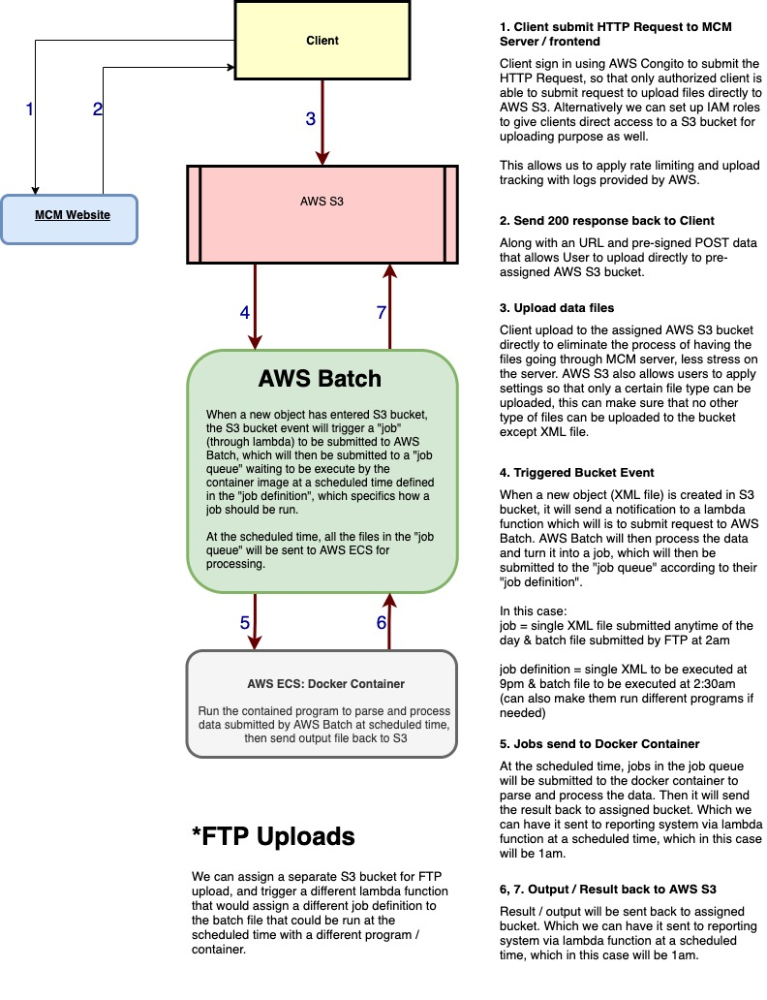
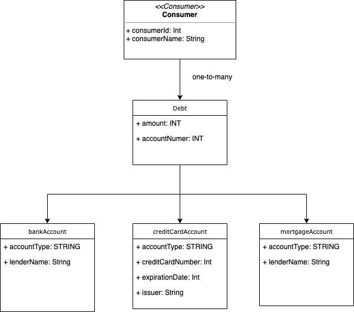

# XMLValidator

Goal: Design a system that read XML files then process the files before feeding the output to a reporting system.

## Constrains:
* receive one record at a time
* each record contains all accounts for a single user
* max 100 accounts per user
* max 100,000 user xml files per day

## Requirements / Todos:
- [x] handle 100 records per second
- [x] combin all records with customed outputs into one single file
- [x] send combined file to receiving system at 1am daily
- [x] receive user records in a single batch file at 2am daily
- [x] do not print account numbers in output
- [x] validation
- [x] HA
- [x] Logging
- [x] allow flexible output format: XML or JSON
- [x] allow addition aggregates
- [x] allow addition account type with same element hierarchy
*
## Assumptions + Make-Up-Requirements
#### my assumptions and other missing requirements
* one record will be process each time
    * result in no concurrency / data race, lock is not required
* Sorting is not needed
    * no data stucture required
* Sorting will be handled by reporting system
    * store output as objects in array
* Updates on records will be handled by reporting system
* Duplicated records will be handled by reporting system
* Only accept upload from authorized endpoints
* Only validated records will be included in output

## Part I - describe and diagram overall system design
1. validation/verification
    1. only authorized clients can upload XML files to their assigned AWS S3 Bucket
    1. using schema stored in container to validate data
    1. invaliad records will not be included in output file
1. error handling
    1. AWS Batch would generate log when a record does not pass the validation
1. logging
    1. AWS provides logging in each steps of the flow, from tracking client login time to data processing etc.
1. performance considerations
    1. allowing clients to upload files directly to S3 without going through MCM's server provide a faster uploading process for clients and minimize the server as the middleman
    1. process files as batch at certain time of the day instead of every time it is received saves on server run time, processing power, memory and cost.
1. libraries & frameworks:
    1. StAX for parsing XML file / JAXP API for parsing XML file by constructing DOM
    1. Docker
    1. React.js / Angular.js or anything as frontend that allows Client to login and upload files to assigned AWS S3 bucket
    1. Spring Boot backend (for rest API that connects to AWS S3 with cognito)
1. software & hardware
    1. Docker run a container to launch application with private resources that is securely isolated
1. cloud services & cloud platform
    1. alternatively we can have the data to be output to DynamoDB that can be shared with the reporting system
    1. AWS Cloud allows flexible output such as XML or JSON files
    1. AWS Transfer Family for authorized client to upload files via FTP to AWS S3
1. storage
    1. AWS S3



```I have worked at a reverse mortgage firm before as an auditor, where I was responsible for auditing loan documents in the company's system before inputting required info in an excel file which is to be sent at 4pm daily to the broker. The process of designing this system had me realize how my experience is so relatable to the design process of this system and made me understand why the excel document I generated daily was needed. And this is the reason I believe processing the data at a certain time of the day instead of every time it is received will increase the performance on the system as it limits the amount of time the system has to process and read and write the data, restricting the amount of data in and out throughout the process, and this is why I chose AWS Batch service as they would process the data depends on the size of the data before assigning processing power and memory to run the job, as we do not know how many files will we receive per day except the maximum amount. Moreover, having the system to be run on cloud provides a solution with high availability, scalability, flexibility, stability, and accessibility for both the company and clients. The whole process is automated and can be done serverless with AWS cloud services, from client authentication to data processing. It is flexible and scalable because you can assign and adjust processing power according to the data volume. You can create different programs to run on specific files (e.g. single record vs batch record). You can switch to processing the data when it is received instead of batch with just a change in the AWS Batch setting. ```

## Part II
1. describe the code used to parse and process the data
    1. XMLReader.java uses StAX to parse the data
    1.
1. UML to describe your class hierarchy and design patterns
    1. please refer to the picture below for UML of class hierarchy
1. advantages
    1. scalability
    1. high availability
        1. using schema to validate incoming data
    1. do not include invaliad records in output file
    1. schema is flexible, allows addition aggregates in the future using xs:all tag
1. disadvantages
1. reason of choice
    1. I've tried StAX and JAXP for parsing and process the data, and found StAX is more suitable in this case.



